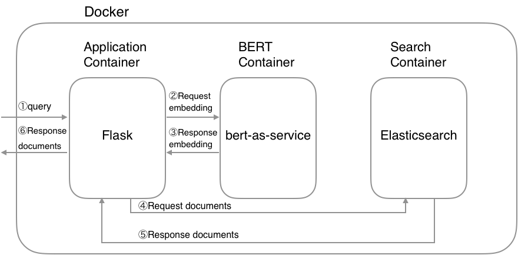

# Elasticsearch meets BERT

Below is a semantic search example:


## System architecture



## Requirements
- python3
- pip3
- Docker
- Docker Compose >= [1.22.0](https://docs.docker.com/compose/release-notes/#1220)

## Getting Started

### 1. Prepare

This will download pretrained BERT models, set environment and install reqiured python packages

```bash
$ source ./prepare
```

### 2. Run Docker containers

This will build images and launch three containers:

* Application container: Flask web service
* BERT container: BERT service
* Search container: Elasticsarch service

```bash
$ docker-compose up -d
```

**CAUTION**: If possible, assign high memory(more than `8GB`) to Docker's memory configuration because BERT container needs high memory.

### 3. Prepare data

You can use the create index API to add a new index to an Elasticsearch cluster. Once you created an index, you’re ready to index some document. After converting your data into a JSON, you can add a JSON document to the specified index and make it searchable. So there are three steps:

* Create indexes: We have two different types of index - pattern_index and semantic_index
* Create documents: We will generate threes documents - pattern_documents, semantic_question and semantic_answer
* Index documents: This will index all three documents above

```bash
$ ./prepare_data
```

### 4. Open browser

Go to <http://127.0.0.1:5050>.
