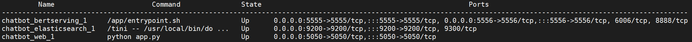

# Chatbot项目说明文档<!-- no toc -->
[目录]
- [Chatbot项目说明文档](#chatbot项目说明文档)
  - [一、项目架构](#一项目架构)
  - [二、目录及文件功能介绍](#二目录及文件功能介绍)
  - [三、search算法](#三search算法)
  - [四、如何替换搜索数据](#四如何替换搜索数据)
  - [五、优化](#五优化)
  - [六、参考资料：](#六参考资料)
  
## 一、项目架构
该项目主要分为三部分，分别为web服务、bert服务和elasticsearch服务。这三个服务分别运行在一个docker[1](#docker)容器中。借助Docker，我们可以将容器当作模块化的虚拟机使用，可以对容器进行相对独立的、脱离原操作系统的配置和部署，从而实现容器的高效创建、部署、复制以及迁移。通过docker compose对这三个容器进行定义和运行，从而实现对Docker容器集群的快速编排。Docker compose[2](#docker-compose)是一个用以运行Docker定义的多容器服务的工具，通过一个后缀为 .yaml的文件进行配置多个容器时如何构成的我们的应用，通过这个工具我们可以通过一行命令`docker-compose up` 来启动由多个容器构成的服务，添加`-d`选项可以使服务在后台运行。然后可以通过命令`docker-compose ps`来查看已经启动的container,  

  
  
从上图可以看到，通过 项目名_container名_序号 的形式自动创建了chatbot_bertserving_1，chatbot_elasticsearch_1，chatbot_web_1 三个容器，这三个容器中的服务交互过程如下图：

  
  
下面分别介绍三个服务的主要功能和实现技术  

* 第一部分：bert服务  
这一部分是NLP算法的核心部分，本项目使用的是在NLP任务中刷新了多项纪录的bert算法[3](#bert)，若需要尝试其他NLP算法，也可以通过替换这一部分服务，来尝试更多的可行方案。当前项目中代码中使用bert预训练模型cased_L-24_H-1024_A-16，输入数据为需要进行向量化的字符串，返回结果为编码后的向量。

* 第二部分：elasticSearch服务[4](#elasticSearch)  
在两个阶段提供服务：
    - 数据准备阶段：处理离线数据，将预置的QA对通过请求bert服务进行编码并存储。
    - 实时数据处理阶段:当web收到搜索请求时，向elasticSearch服务器提供已通过bert服务转化为向量的数据， elasticSearch 将收到的向量与数据库中存储QA对对应的向量进行相似度匹配，并将查询到的QA对及相似度评分结果返回给web服务器。  

* 第三部分：web服务  
Web服务使用python语言编写，结合Flask轻量级可定制框架实现web服务。  
Web服务负责与用户交互的网页页面展示及用户请求处理，当收到搜索请求时，将用户请求发送给bert服务器，通过bert预训练模型将用户搜索问题向量化，然后再将搜索问题向量发送给elasticSearch服务器，收到返回匹配结果后，将结果可视化，展示在网页页面中。  

## 二、目录及文件功能介绍
首先介绍几个配置文件：

- README.md: 详细讲述了如何将本项目在本地进行部署。
- requirements.txt: 记录python需要的package及版本号。
- prepare: 下载bert预训练模型、设置环境变量、为python安装requirements.txt 所指定的package
- docker-compose.yaml：docker-compose的配置文件
- prepare_data：shell脚本文件，将create index、 create document 和index document 命令集成在一个脚本中，方便快速生成离线文件。执行script目录下的python文件，按照data目录下的pattern_index.json、semantic_index.json
格式生成elasticsearch的index,  将data/chatbot-qa-100.csv 中的问题和答案分别按模式匹配和语义匹配方式，存储成data/\*_documents.json文件。index_documents.py对*_documents.json进行索引。
  
文件目录介绍：
 1. bertserving目录：  
Dockerfile: 负责bert服务 所在的docker容器的环境配置及启动文件配置  
Entrypoint.sh：是该docker的启动文件，被Dockerfile调用

 2. Data目录：  
放置需要被搜索的QA对文件：chatbot-qa-100.csv。指定elasticsearch的index格式的.json文件。还有未来由elasticSearch生成的.json文件也会存放在该路径下。  

 3. script目录：
存放用来准备离线数据需要的python脚本。包括三个文件：create_documents.py, create_index.py, index_documents.py。
    - create_index.py 按照--index_file指定的文件格式，创建elasticsearch的index。
    - create_documents.py 读取通过--data 指定的QA对文件按照--index_name指定的格式，将bert编码后的QA对文件保存到--save指定的文件中。
    - index_documents.py 将--data指定的文件加载到elasticsearch中，并对其建立索引。

 4. web目录：  
存放了构建web服务的代码。
    - Dockerfile: 进行docker容器的环境配置，安装pip，并通过pip安装所需要的在requirement.txt中指定的package, 然后运行app.py启动web服务。
    - app.py 使用flask框架进行web开发，flask的具体使用方法可以参见网站快速上手flask[5](#flask)  
    - requirement.txt 指定python所需要下载并安装的package。
    - tesmplates目录下存放flask中的render_template() 方法所需要使用的模板  
    - static 目录，css目录下存放web页面的样式控制.css文件，配置网页中的字体、字号、颜色、框大小、布局位置等信息。img目录中放置了网页页面中需要展示的图片。  

  5. docs：
存放.md文件用到的图片文件  

## 三、search算法
search算法主要负责对用户搜索的问题匹配到我们预先准备好的数据并将每条数据按相关度评分。本项目中已实现的算法主要分为模式匹配算法和bert算法。这两种算法又分为两种不同的搜索域：按问题匹配和按答案匹配。
* 模式匹配算法：  
完全机械式的匹配算法，不包含自然语言处理的任何算法，完全按照用户问题和搜索域中的文字字对字的匹配，不考虑字词间的含义与联系。
  
* bert算法：  
BERT是双向编码器表示的缩写，是一个语言表征模型（language representation model），通过超大数据、巨大模型、和极大的计算开销训练而成，在11个自然语言处理的任务中取得了最优。
首先，BERT是Transformers的双向编码器表示。  
其次，BERT是在大量未标记文本的预训练，包括整个Wikipedia(有25亿个词!)和图书语料库(有8亿个单词)。它仅使用纯文本语料库进行训练。预训练任务包含两种，分别为marked LM 和下一句预测。这个预训练步骤是BERT成功背后的一半。这是因为当我们在大型文本语料库上训练模型时，我们的模型开始获得对语言工作原理的更深入和深入的了解。这种知识几乎可用于所有NLP任务。  
第三，BERT是"深度双向"模型。双向意味着BERT在训练阶段从目标词的左右两侧上下文来学习信息。  
BERT旨在进行多任务学习，也就是说，它可以同时执行不同的NLP任务，这也是BERT最令人印象深刻的方面。我们可以通过仅添加几个其他输出层来微调它，以创建用于各种NLP任务的最新模型。关于BERT模型的更深入理解推荐推荐阅读博客[6](#bert-blog)  
在我们的项目中，通过bert-as-service来将一段文字编码为一个固定长度的向量，从而通过向量来进行问题的匹配。需要了解更多的bert-as-service的相关知识可以参考bert-as-service Documentation[7](#bert-as-service)

## 四、如何替换搜索数据
  1. 建立列名分别为Question 和 Answer的n*2的表格文件，并命名为chatbot-qa-100.csv，然后将其拷贝到data/路径下，覆盖原来的同名文件。
  2. `docker-compose down`， 停止所有已经启动的容器，并移除网络
  3. 在chatbot目录下执行`export PATH_MODEL=./cased_L-24_H-1024_A-16`，重新设置环境变量
  4. `docker-compose up -d`, 启动yaml文件中配置的容器并建立网络
  5. 通过`docker-compose ps`, 查看是否三个服务都已经成功启动，state均为up代表服务均已启动就绪，若有服务状态为Exit，可使用 `docker container logs container_name` container_name为`docker-compose ps`结果中state为Exit的container的name，通过查看对应的container的log来定位错误，并解决，然后重复步骤2
  6. `./prepare_data` 用新的QA文件重新准备所需的离线文件，并将数据加载到elastsearch中建立搜索索引。该过程执行时间与QA文件的大小、所使用的bert模型的复杂度、配置服务的设备的性能相关。当前100条QA对数据和模型，4个CPU、12GB内存的虚拟机上运行需要5-10分钟。
  7. 在本地浏览器中访问http://127.0.0.1:5050, （若需要在同一局域网中的其他设备访问，将链接中的127.0.0.1换为提供web服务的server的IP地址即可），即可在新的数据中搜索问题与答案。  
   
## 五、优化
* 简单修改算法的搜索域，可以考虑同时在问题和答案中搜索，而不是分别搜索  
* bert模型的优化，可参考google search 的官方git仓库中提供的方法[8](#bert-git)  
* 设计新的搜索服务和数据存储方式，从而取代elasticSearch所提供的服务  
  
## 六、参考资料：

- [1] [docker教程](https://www.runoob.com/docker/docker-tutorial.html)

- [2] [[docker compose教程](https://www.runoob.com/docker/docker-compose.html)

- [3] [bert算法论文] (https://arxiv.org/pdf/1810.04805.pdf)

- [4] [Elasticsearch教程及权威指南] (https://www.elastic.co/guide/cn/elasticsearch/guide/current/intro.html)

- [5] [快速上手flask](https://dormousehole.readthedocs.io/en/latest/quickstart.html#html)

- [6] [理解BERT：一个突破性NLP框架的综合指南](https://www.jiqizhixin.com/articles/2019-11-05-2)

- [7] [bert-as-service Documentation](https://bert-as-service.readthedocs.io/en/latest/)

- [8] [googl-search bert git仓库](https://github.com/google-research/bert)
